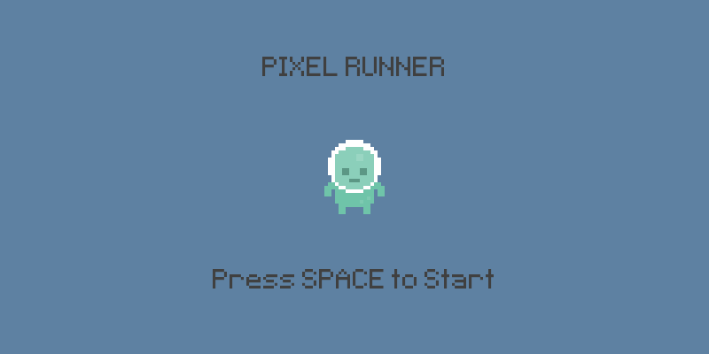
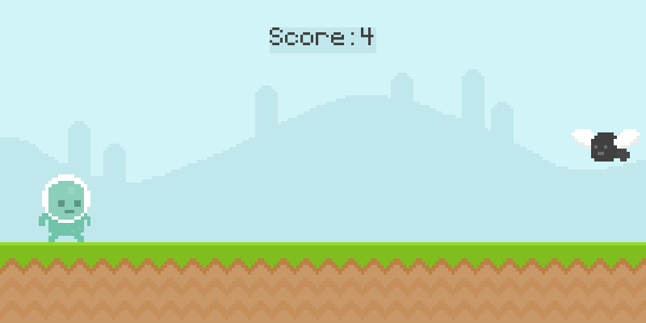
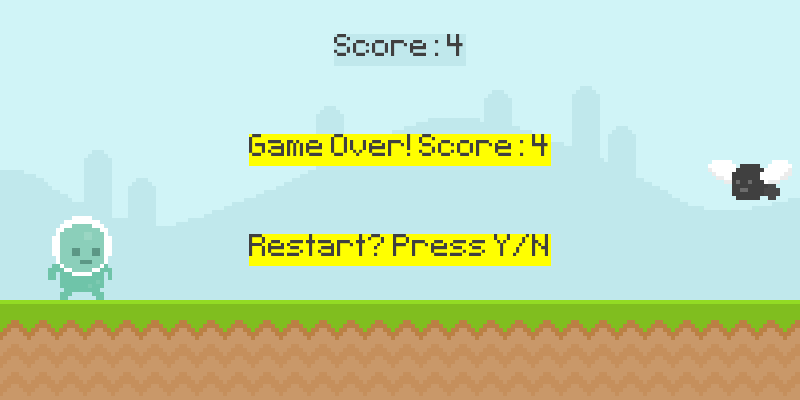

# 🏃‍♂️ Pixel Runner

Hi! In my first semester of college, I found this great tutorial by Clear Code on YouTube and I just replicated it. I guess that was the first real program I made and that's when I started coding.

A fun and addictive 2D endless runner game built with Pygame! Navigate your pixel character through an endless landscape, jumping over obstacles to achieve the highest score possible.

## 🎮 Game Features

- **Endless Runner Gameplay** - Run as far as you can!
- **Dynamic Obstacles** - Face different enemies including snails and flies
- **Smooth Animations** - Fluid character and enemy animations
- **Score System** - Track your best runs and challenge yourself
- **Simple Controls** - Easy to learn, hard to master
- **Retro Pixel Art Style** - Beautiful pixel graphics and custom font

## 🕹️ How to Play

- **SPACE** or **MOUSE CLICK** - Jump over obstacles
- **SPACE** or **Y** - Restart after game over
- **N** - Quit game

Avoid the snails on the ground and flies in the air. The longer you survive, the higher your score!

## 📸 Screenshots

### Start Screen



### Gameplay



### Game Over



## 🚀 Installation & Setup

### Quick Start

1. **Download/Clone** this repository
2. **Run the setup script:**
   ```bash
   python setup.py
   ```
3. **Start the game:**
   ```bash
   python run_game.py
   ```
   Or directly:
   ```bash
   python src/pixel_runner.py
   ```

### Manual Installation

1. **Install Python 3.7+** if not already installed
2. **Install Pygame:**
   ```bash
   pip install -r requirements.txt
   ```
   Or manually:
   ```bash
   pip install pygame
   ```
3. **Run the game:**
   ```bash
   python src/pixel_runner.py
   ```

## 🛠️ Technical Details

- **Engine**: Pygame 2.5.0+
- **Language**: Python 3.7+
- **Resolution**: 800x400 pixels
- **FPS**: 60 frames per second
- **Architecture**: Object-oriented design with clean separation of concerns

## 🎮 Controls Summary

| Action     | Key/Input                 |
| ---------- | ------------------------- |
| Jump       | SPACE or Mouse Click      |
| Start Game | SPACE (on start screen)   |
| Restart    | SPACE or Y (on game over) |
| Quit       | N (on game over)          |

## 🏆 High Score Tips

- **Time your jumps perfectly** - Don't jump too early or too late
- **Watch for patterns** - Learn enemy spawn patterns
- **Stay focused** - The game gets faster as your score increases
- **Practice makes perfect** - Keep playing to improve your reflexes
